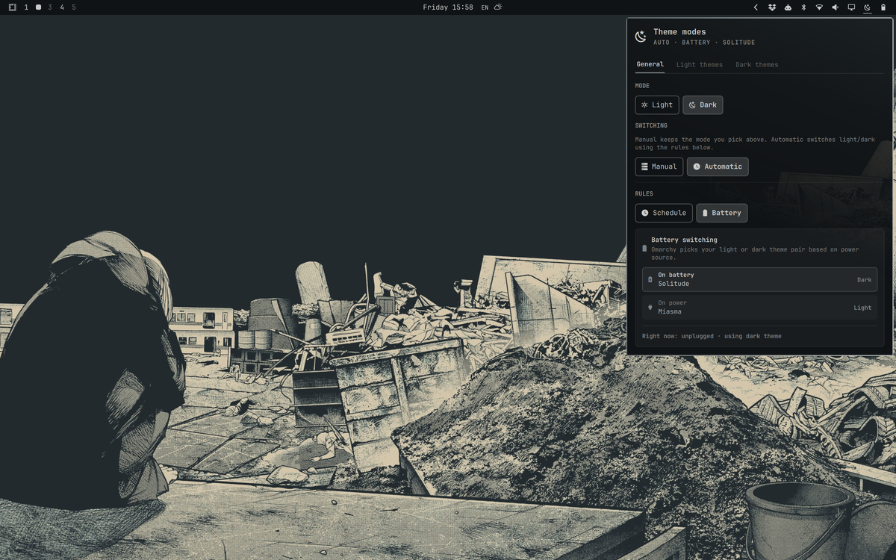
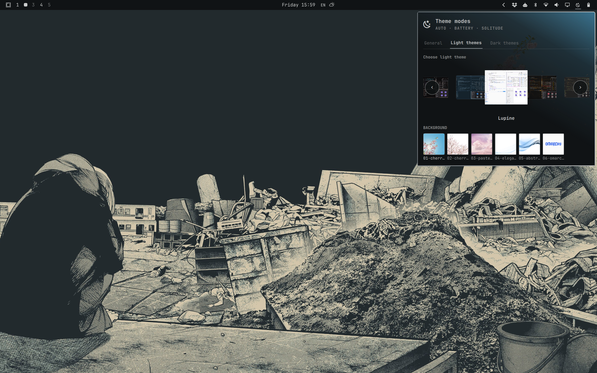
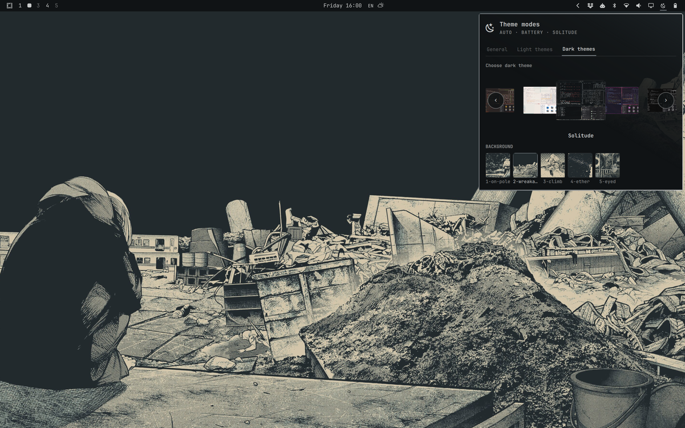

# omarchy-theme-modes

Separate **light** and **dark** Omarchy themes with per-mode backgrounds, manual switching, and optional automatic mode by schedule or battery.



Pick different themes for day and night, choose a background for each, and switch with one click — or let Omarchy follow the clock or power source.





> **Note:** Configure themes and backgrounds in this plugin's panel. Omarchy's native theme/background switchers do not update these presets (by design — no polling, no global hooks).

## Features

- **Dual presets** — independent light and dark theme + background pairs
- **Tabbed panel** — General · Light themes · Dark themes
- **Theme carousel** — infinite scroll, size highlights selection, debounced apply
- **Background picker** — thumbnails for each theme's bundled backgrounds
- **Panel preview** — active theme background fades in from the top-right
- **Manual mode** — pick light or dark yourself
- **Automatic mode** — schedule (light/dark times) or battery (dark on battery, light on power)
- **Bar shortcuts**
  - **Left-click** — open panel
  - **Right-click** — toggle light ↔ dark (applies saved theme + background)
  - **Middle-click** — follow automatic rules

## Requirements

- [Omarchy](https://omarchy.org) with shell plugin support (Quattro)
- `bash`, `jq`
- Omarchy CLI tools: `omarchy theme`, `omarchy theme bg`, `omarchy-theme-switcher` (preview cache)

No additional packages, sudo, or network access are required at runtime.

## Install

### From git (recommended)

```bash
omarchy plugin add https://github.com/esemczak/omarchy-theme-modes.git --enable --yes
omarchy restart shell
```

### Manual copy

```bash
git clone https://github.com/esemczak/omarchy-theme-modes.git \
  ~/.config/omarchy/plugins/esemczak.theme-modes

omarchy plugin validate ~/.config/omarchy/plugins/esemczak.theme-modes
omarchy plugin enable esemczak.theme-modes --section right
omarchy restart shell
```

## Remove

```bash
omarchy plugin disable esemczak.theme-modes
omarchy plugin remove esemczak.theme-modes --yes
omarchy restart shell
```

Optional — delete saved plugin state:

```bash
rm -f ~/.local/state/omarchy/settings/theme-modes.json
```

Removing the plugin does not revert themes or backgrounds already applied through Omarchy.

## Usage

1. Click the bar icon (sun/moon) to open the panel.
2. **General** — set current mode, manual vs automatic, schedule or battery rules.
3. **Light themes** / **Dark themes** — scroll the carousel to pick a theme; click a background thumbnail below.
4. **Right-click** the bar icon anytime to flip between your saved light and dark setups.

Settings persist in:

```
~/.local/state/omarchy/settings/theme-modes.json
```

The plugin only writes that state file and invokes Omarchy theme commands when you change settings. It does not modify Hyprland, shell defaults, or other user configuration without explicit action in the panel or bar shortcuts.

## IPC

Target: `esemczak.theme-modes`

```bash
omarchy-shell esemczak.theme-modes toggle          # toggle light/dark mode
omarchy-shell esemczak.theme-modes followAutomatic # switch to automatic rules
omarchy-shell esemczak.theme-modes status          # JSON status
omarchy-shell esemczak.theme-modes refreshThemes    # reload theme catalog
```

## Validate before publishing

```bash
omarchy plugin validate ./omarchy-theme-modes
```

## Project layout

```
omarchy-theme-modes/
├── manifest.json      # Plugin metadata (id: esemczak.theme-modes)
├── preview.png        # Marketplace listing preview
├── Panel.qml          # Bar widget + panel UI
├── Service.qml        # State, theme apply, auto timers
├── Model.js           # State parse/serialize, auto logic
├── lib/
│   ├── security.sh      # Slug/path validation helpers (bash)
│   └── security_core.py # Descriptor-safe I/O and bounded subprocess reads
├── bootstrap-state.sh   # Safe read of plugin state + current theme
├── safe-write-state.sh  # Atomic bounded write of plugin state
├── catalog.sh           # Theme list + preview paths
├── theme-list-fallback.sh # Bounded fallback theme catalog JSON
├── backgrounds.sh       # Background list for a theme slug
├── docs/screenshots/  # README screenshots
├── LICENSE
└── CHANGELOG.md
```

## Screenshots

Real desktop captures at 1200 px wide. The root [`preview.png`](preview.png) matches the light-themes shot for marketplace listings.

| Preview | Description |
|---------|-------------|
| [panel-general.png](docs/screenshots/panel-general.png) | General tab — automatic battery rules |
| [panel-light-themes.png](docs/screenshots/panel-light-themes.png) | Light theme carousel + backgrounds |
| [panel-dark-themes.png](docs/screenshots/panel-dark-themes.png) | Dark theme carousel + backgrounds |

See [docs/screenshots/README.md](docs/screenshots/README.md) for capture notes.

## Development

The plugin hot-reloads when files under `~/.config/omarchy/plugins/` are saved. Otherwise:

```bash
omarchy restart shell
```

Test validation after changes:

```bash
omarchy plugin validate ~/.config/omarchy/plugins/esemczak.theme-modes
```

## Security

Plugins run as unsandboxed code inside `omarchy-shell`. Review the source before installing.

This plugin executes local Omarchy CLI commands and reads theme/background directories on your machine; it does not download or execute remote code.

Hardening measures in this release:

- Theme slugs are validated against a strict allowlist before any shell command or path construction runs.
- Plugin state and the current theme name are read through no-follow, regular-file helpers with byte limits; state is written atomically into a verified private directory.
- Theme/background catalog helpers run under `timeout`, cap stdout before QML parsing, and only expose image paths that resolve under anchored Omarchy theme/background or cache roots after no-follow regular-file checks.
- Catalog and background helpers enforce producer-side ceilings on input line bytes, field/path bytes, record counts, and total emitted JSON bytes; QML collectors terminate processes once stdout exceeds the matching limit during streaming.
- Descriptor-safe helpers open private directories once, perform atomic writes via `dir_fd`, read regular files through bounded loops, materialize validated images into a private cache bound to the validated fd, and read theme lists from child pipes incrementally with deadlines.

## License

MIT — see [LICENSE](LICENSE).

## Author

esemczak
